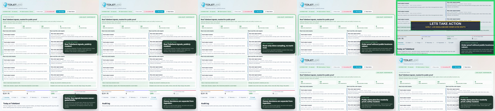

# Toiletland × Hermes — Autonomous Ops Desk

**Hermes recommends. Owner decides. Audit proves it.**

This is a hackathon project showing a safety-first operating desk for a real owner-operated e-commerce business. Hermes watches operational signals, drafts recommended actions, requires owner approval, and persists decisions in a local audit trail.

## Demo links

- **Video:** https://youtu.be/BDsFZqQUK8A
- **X demo post:** https://x.com/ToiletlandCA/status/2071977729655033944
- **Discord hackathon thread:** https://discord.com/channels/1053877538025386074/1521439452894072863

## What it proves

The public demo is a **public-masked live-readonly proof**:

- 20 redacted live-readonly snapshots ingested into the local SQLite/audit architecture
- 10 email snapshots + 10 WooCommerce snapshots
- raw records stored: **0**
- live mutations: **0**
- no email send, mark-read, move, or delete
- no WooCommerce order edits, refunds, or fulfilment changes
- no Stripe live charges, Payment Links, Checkout sessions, or refunds
- no Google Ads publish, budget, or spend changes
- no shipping/vendor/social/cron automation

The repo also includes redacted fixtures so the demo can run locally without credentials.

## Why this matters

Most agent demos jump from “AI can act” to “AI should act.” This project focuses on the missing trust layer for real SMB operations:

1. ingest signals safely,
2. redact and structure them,
3. draft actions,
4. require owner approval,
5. write an audit trail,
6. keep live mutations disabled unless explicitly approved.

## Run locally

### Static fixture demo

```bash
cd control-room-demo
python3 -m http.server 8765 --bind 127.0.0.1
```

Open <http://127.0.0.1:8765/>.

### Local backend + SQLite audit trail

```bash
python3 control-room-demo/backend/server.py
```

Open <http://127.0.0.1:8770/>.

The backend binds to `127.0.0.1` and returns `executed=false` for owner decisions. Live connector mutations are not enabled.

## Live-readonly connector proof

See [`README_LIVE_READONLY.md`](README_LIVE_READONLY.md).

Credentials are not included. To run read-only ingestion yourself, copy `live-readonly.env.example` into `.secrets/live-readonly.env`, add read-only credentials, and run the validation commands documented there. `.secrets/`, `.env`, and generated SQLite files are gitignored.

## Safety posture

See [`docs/safety.md`](docs/safety.md) and [`docs/architecture.md`](docs/architecture.md).


